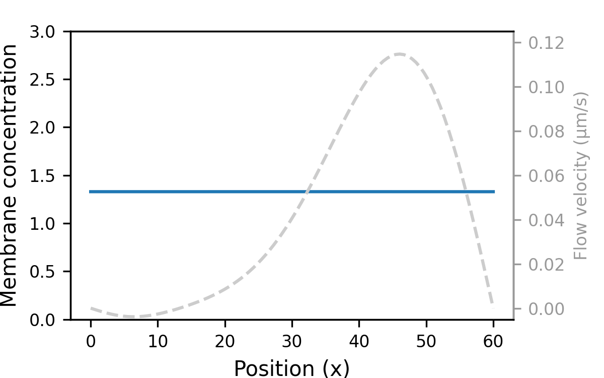

# Illukkumbura et al., 2023

[![CC BY 4.0][cc-by-shield]][cc-by]

Code for performing PDE modelling of advective transport in Illukkumbura et al., 2023

    

## Instructions

See [this notebook](scripts/notebook.ipynb) for a demonstration of the model

To run in the cloud, click the 'launch binder' button above

## Citation

This work is featured in the following preprint article:

Rukshala Illukkumbura, Nisha Hirani, Joana Borrego-Pinto, Tom Bland, KangBo Ng, Lars Hubatsch, Jessica McQuade, Robert G. Endres, Nathan W. Goehring
bioRxiv 2022.09.05.506621; doi: https://doi.org/10.1101/2022.09.05.506621

## License

This work is licensed under a
[Creative Commons Attribution 4.0 International License][cc-by].

[![CC BY 4.0][cc-by-image]][cc-by]

[cc-by]: http://creativecommons.org/licenses/by/4.0/
[cc-by-image]: https://i.creativecommons.org/l/by/4.0/88x31.png
[cc-by-shield]: https://img.shields.io/badge/License-CC%20BY%204.0-lightgrey.svg
