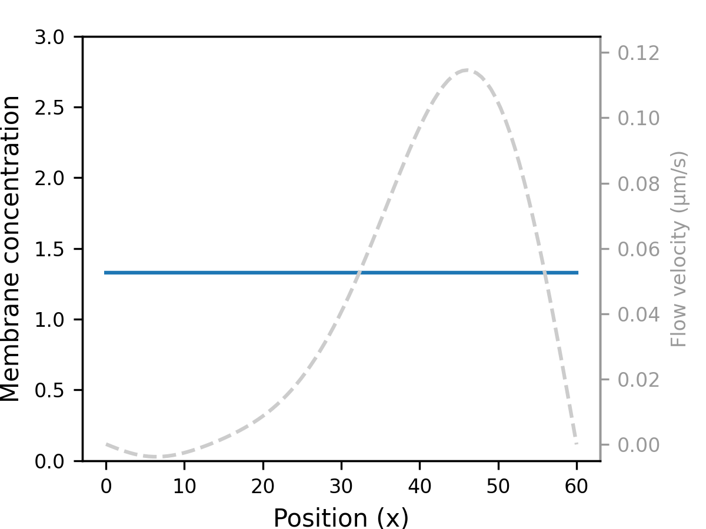

[![CC BY 4.0][cc-by-shield]][cc-by]

# Illukkumbura et al., 2022

Code for performing PDE modelling of advective transport in Illukkumbura et al., 2022

    

## Instructions

To launch the interactive notebook with binder, click the 'launch binder' button above.

## Citation

## License

This work is licensed under a
[Creative Commons Attribution 4.0 International License][cc-by].

[![CC BY 4.0][cc-by-image]][cc-by]

[cc-by]: http://creativecommons.org/licenses/by/4.0/
[cc-by-image]: https://i.creativecommons.org/l/by/4.0/88x31.png
[cc-by-shield]: https://img.shields.io/badge/License-CC%20BY%204.0-lightgrey.svg
